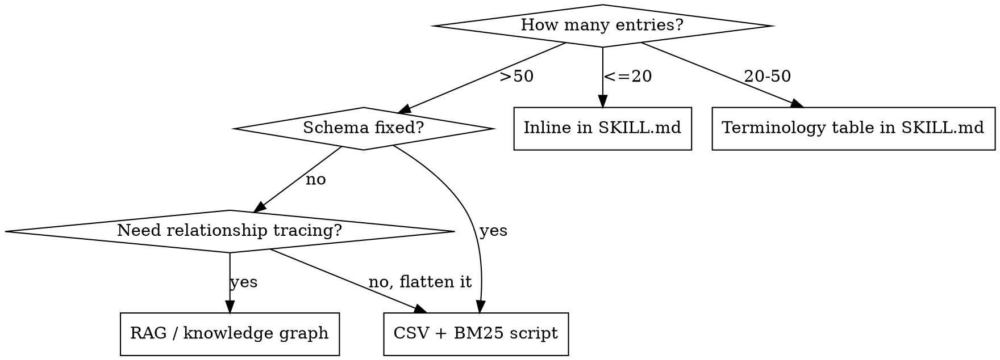

# Skill Engineering - Knowledge-Base Skill Design

AI doesn't need to *know* knowledge. It needs to *find* knowledge.

SKILL.md teaches AI **how to search**, not **what to remember**. Knowledge lives in structured data; the skill is a retrieval guide with decision rules.

## Architecture

```
SKILL.md（指令层）       ← 规则 + 搜索指引 + 决策表 + 检核清单
references/（叙事层）    ← 流程描述、架构文档，按需加载
scripts/（检索层）       ← BM25 / grep wrapper / 聚合生成器
data/（数据层）          ← CSV / JSON，每行 = 一个自包含知识实体
```

Context consumption is **constant** regardless of knowledge scale: rules are fixed, data is pulled on demand (top N), references are loaded only when relevant.

## Core Principle: Do Not Over-Engineer

If total knowledge entries <= 50, keep everything inline in SKILL.md. Most skills are Light level — don't create CSV/scripts/references unless the scale demands it.

## Knowledge Classification

Knowledge has two orthogonal dimensions: **Form** (what it looks like) and **Scale** (how many).

### Dimension 1: Form

| Form | Examples | Key Test |
|---|---|---|
| **Countable entity** | A term, a config, an error code, a queue, a service | Can you put it in one CSV row? → Entity |
| **Process description** | A multi-step flow, an architecture diagram, a processing chain | Is it narrative steps that lose meaning when flattened? → Process |

Why this matters: the original single-dimension (count only) classification led to process descriptions being force-flattened into CSV rows, destroying their semantic structure.

### Dimension 2: Scale

**For countable entities:**



**For process descriptions:**

| Total Lines | Storage |
|---|---|
| <=30 lines | Inline in SKILL.md |
| >30 lines per topic | `references/*.md` — one file per topic |

### The `references/` Pattern

Process descriptions that are too long to inline but too structured for RAG go into `references/`. SKILL.md doesn't embed the content — it provides a **load guide** telling AI when to load each file:

```markdown
## Reference Files
| File | Content | When to Load |
|------|---------|-------------|
| `references/order-flow.md` | Order processing pipeline | Writing order-related code |
| `references/auth-architecture.md` | Auth/authorization chain | Modifying login or permission logic |
```

Rules:
- One topic per file (no mega-references)
- Each file is self-contained
- SKILL.md specifies **when** to load, not just **what** is in it
- Never load all references at once — that defeats the purpose

## Anti-Patterns

| Anti-Pattern | Why It Fails | Fix |
|-------------|-------------|-----|
| Dump everything into SKILL.md | Context explosion, AI performance degrades beyond 12+ loaded skills | Classify by form + scale, sink accordingly |
| Flatten process descriptions into CSV rows | Narratives lose meaning when forced into tabular format | Put in `references/*.md` |
| Load all reference files at once | Same as dumping into SKILL.md — context explosion | Load guide with conditions |
| CSV without search_cols/output_cols separation | Search matches wrong fields; output too sparse or too noisy | Design schema intentionally |
| One mega-CSV for all domains | BM25 can't distinguish contexts; low precision | Split by domain, add auto-routing |
| Hardcode >10 decision rules in SKILL.md | Can't extend without editing rules | Extract to reasoning CSV |
| Skip source verification | Knowledge drifts from reality | Always verify, timestamp entries |
| RAG for enumerable knowledge | Overkill; less precise than BM25 for structured data | Use CSV + BM25 |
| Inline >50 terminology entries | SKILL.md too long, loaded every time skill triggers | Move to CSV with search script |

## Knowledge Lifecycle

```
Add knowledge -> Classify (form + scale) -> Choose storage -> Verify from source -> Write
                                                                                      |
Update <- Periodic audit <- Source changes <- Timestamp all entries             <------+
                                                                                      |
Deprecate -> Mark deprecated -> Remove next version                            <------+
```

**Iron rule**: All knowledge must be verified from primary source (source code, official docs). Never reference second-hand analysis.

## Sizing Examples

| Level | Knowledge Scale | Architecture | Example |
|-------|----------------|--------------|---------|
| **Light** | <=50 entities, <=30 line processes | Pure SKILL.md | navigate-codebase, channel-testing |
| **Medium** | 50-200 entities or long processes | SKILL.md + references/ + terminology tables | payment-flow, blockchain-monitor |
| **Heavy** | >200 entities | SKILL.md + references/ + CSV + BM25 scripts | ui-ux-pro-max (50+ styles, 161 palettes) |
| **External** | Unbounded | SKILL.md + RAG/MCP | cps-rag (full source code) |
